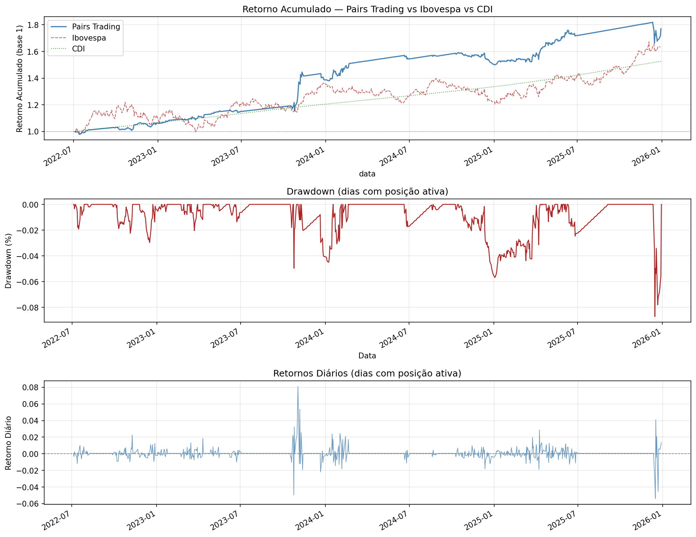
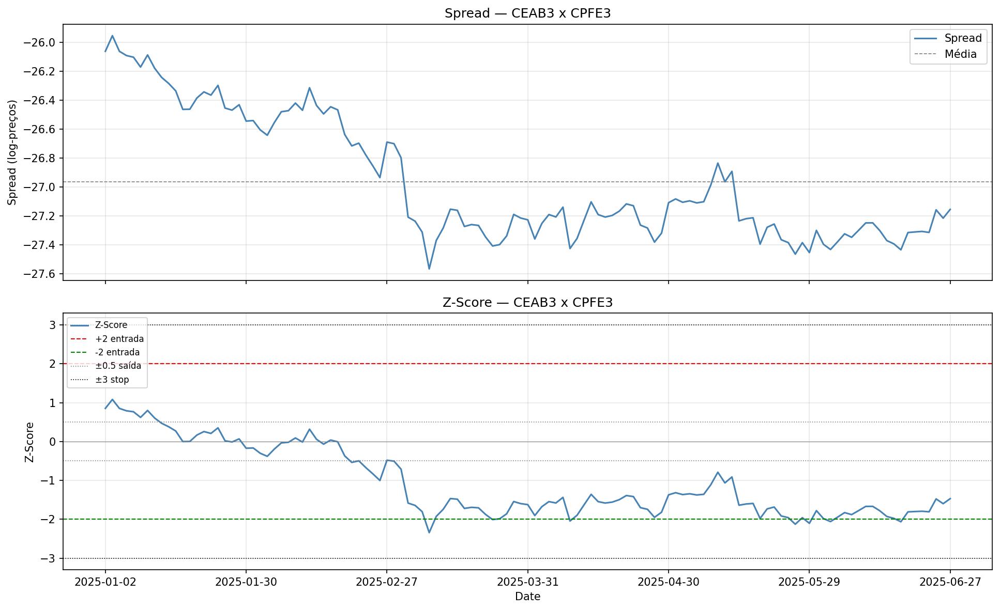
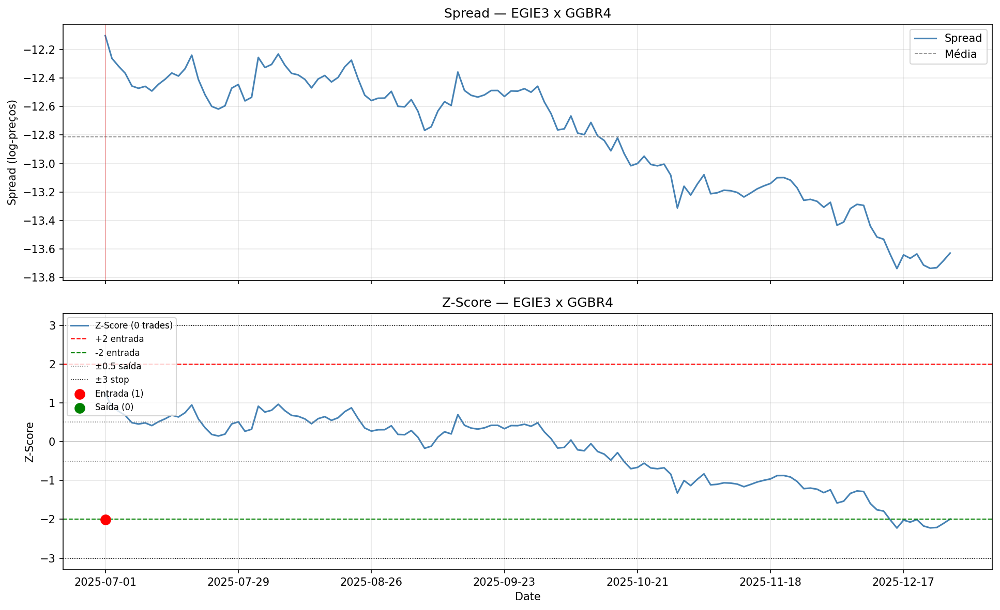

# Pairs Trading — Mercado de Ações Brasileiro (2022–2025)


Implementação quantitativa de uma estratégia de **arbitragem estatística long-short** baseada em cointegração, aplicada às 50 ações mais líquidas do Ibovespa no período de julho de 2022 a dezembro de 2025. A metodologia segue Caldeira (2013), com extensões que incorporam o Filtro de Kalman para estimação dinâmica do hedge ratio e o Expoente de Hurst como critério adicional de filtragem dos pares.

---

## Resultados

| Métrica | Estratégia | CDI | Ibovespa |
|---|---|---|---|
| Retorno acumulado | **77,07%** | 52,77% | 62,75% |
| Retorno anualizado | **17,78%** | 12,89% | 15,00% |
| Volatilidade anual | 15,36% | — | — |
| Sharpe anualizado | 0,5689 | — | — |
| Maximum Drawdown | -10,79% | — | — |
| Beta vs Ibovespa | 0,1677 | — | — |
| Correlação Ibovespa | 0,1984 | — | — |

> **Período:** 04/07/2022 → 30/12/2025 (3,49 anos) · **Dias ativos:** 425 de 866 · **Custos de transação:** 0,10% por operação



---

## Metodologia

A estratégia opera em janelas rolantes de **12 meses de estimação + 6 meses de trading**, repetidas ao longo do período amostral. O pipeline completo é descrito abaixo.

### 1. Seleção do universo e filtragem de estacionariedade

- Download dos log-preços diários das 50 ações mais líquidas do Ibovespa em cada janela
- Exclusão de séries que rejeitam a hipótese de raiz unitária pelo teste ADF em nível (séries I(0))
- Aplicação conjunta dos testes ADF e KPSS em nível e em primeira diferença; séries com resultado conflitante entre os dois testes são excluídas
- Apenas séries confirmadas como **I(1)** entram no teste de cointegração

### 2. Identificação dos pares cointegrados

- Teste de Johansen par a par (estatística traço e máximo-autovalor) com valor crítico de **15,49 a 95% de confiança**
- Para cada par cointegrado, são calculados:
  - **Beta de cointegração** — vetor de Johansen
  - **Meia-vida** — estimada via equação de Ornstein-Uhlenbeck
  - **Expoente de Hurst** — medida de persistência/anti-persistência do spread

### 3. Filtragem dos pares

Os pares são incluídos na carteira somente se satisfizerem simultaneamente:

| Critério | Threshold |
|---|---|
| Estatística traço (Johansen) | > 15,49 |
| Meia-vida do spread | < 30 dias úteis |
| Expoente de Hurst | < 0,5 |
| Média do z-score fora da amostra | \|z\| < 1,5 |
| Ocorrências do ativo na carteira | ≤ 2 pares |

### 4. Geração dos sinais de trading

- **Z-score** calculado com o beta estático do Johansen, normalizado pela média e desvio-padrão do spread estimados na janela de formação
- Filtro adicional fora da amostra: pares cuja média do z-score no período de trading supera 1,5 em valor absoluto são descartados, sinalizando quebra da relação de cointegração
- Limite de concentração: cada ativo pode aparecer em no máximo **2 pares** da carteira simultaneamente

### 5. Regras de entrada e saída

| Evento | Threshold |
|---|---|
| Entrada long/short | z-score cruza ±2,0 |
| Saída normal | z-score retorna a ±0,5 |
| Stop loss | z-score atinge ±3,0 |
| Encerramento compulsório | Posição aberta por mais de 1 meia-vida sem reversão |

### 6. Dimensionamento das posições

O hedge ratio é calculado **dinamicamente pelo Filtro de Kalman**, inicializado com o beta estático do Johansen. O filtro atualiza o ratio a cada novo pregão, adaptando-se a mudanças graduais na relação de equilíbrio entre os ativos.

---

## Exemplo de Par Cointegrado

O gráfico abaixo ilustra o spread padronizado entre dois pares identificados pela estratégia, com as bandas de entrada (±2σ), saída (±0,5σ) e stop (±3σ):




---

## Stack

| Biblioteca | Uso |
|---|---|
| `pandas` / `numpy` | Manipulação de séries temporais e cálculos matriciais |
| `statsmodels` | Testes ADF, KPSS e cointegração de Johansen |
| `pykalman` | Filtro de Kalman para hedge ratio dinâmico |
| `yfinance` | Download de preços do Ibovespa (benchmark) |
| `matplotlib` | Visualização dos resultados |
| `requests` | Coleta da série CDI via API do Banco Central |

---

## Estrutura do Repositório

```
pairs-trading/
│
├── armazenamento.ipynb              # Pipeline de estimação (formação dos pares)
├── resultados.ipynb                 # Consolidação de resultados e gráficos
│
├── periodo_1_jul2021_dez2022.xlsx   # Resultados período 1
├── periodo_2_jan2022_jun2023.xlsx   # Resultados período 2
├── periodo_3_jul2022_dez2023.xlsx   # Resultados período 3
├── periodo_4_jan2023_jun2024.xlsx   # Resultados período 4
├── periodo_5_jul2023_dez2024.xlsx   # Resultados período 5
├── periodo_6_jan2024_jun2025.xlsx   # Resultados período 6
├── periodo_7_jul2024_dez2025.xlsx   # Resultados período 7
│
├── Resultados.xlsx                  # Série diária de retornos (sem CDI)
├── Resultados_com_CDI.xlsx          # Série diária de retornos (com CDI nos períodos inativos)
│
├── analise_estrategia.png           # Gráfico consolidado de performance
├── spread_*.png                     # Spreads padronizados de pares selecionados
└── README.md
```

---

## Referência

CALDEIRA, J. F. Arbitragem estatística, estratégia long-short pairs trading, abordagem com cointegração aplicada ao mercado de ações brasileiro. **Economia**, Brasília, v. 14, n. 1B, p. 521–546, mai./ago. 2013.
